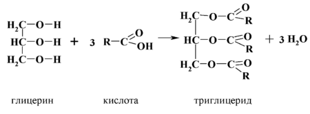
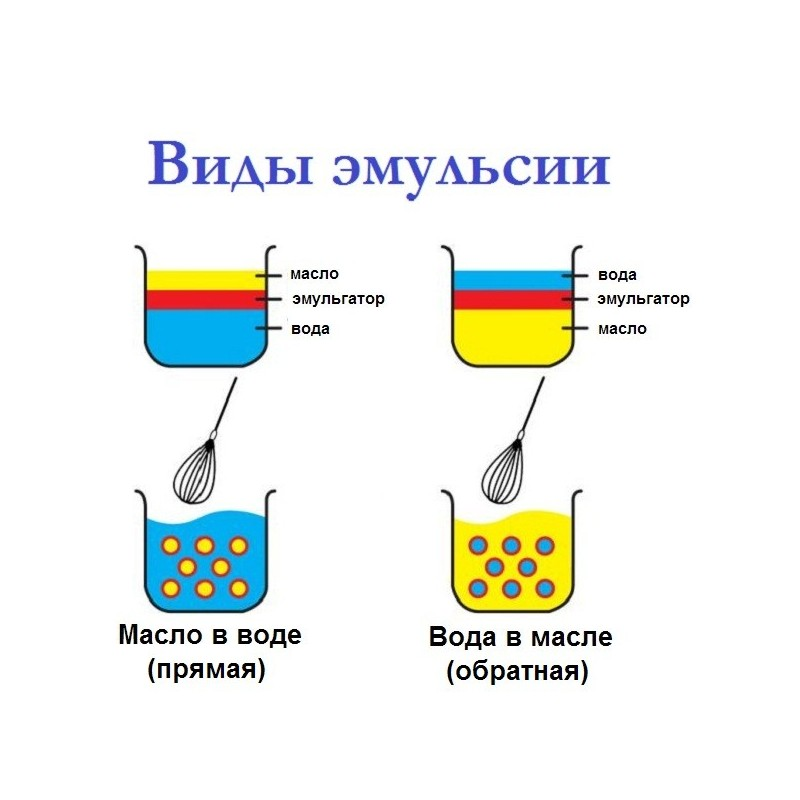

FatTheory
[Эмульгаторы](#emuliser)
---

## Получение жиров и масел
Подготовка большинства семян начинается с удаления грязи, шелухи, камней и др примесей с использованием просеивания и продувания, а так же магнитные и электромагнитные сепараторы. Затем, семена обрушивают и аспирацией удаляют оболочки, семена рапса и сафлора не обрушивают. Далее семена измельчают дроблением или плющением. Следующий шаг это тепловая обработка от 80 до 105°С.

### Подготовленные масличные семена обрабатываются одним из трех процессов:
- Прессование с использованием форпрессов и экспеллеров (шнековый пресс);
- Экстракция растворителем с предварительным прессованием;
- Экстракция растворителем с использованием экспандера (экструдер);
- Прямая экстракция растворителем.
- Прессование с использованием форпрессов и экспеллеров – механический отжим масличного сырья, с относительно высоким содержанием масла. Получают неочищенное прессовое масло и жмых, масло после отстаивания и фильтрации направляют на дальнейшую обработку.
- Экстракция растворителем с предварительным прессованием – часть масла удаляется прессованием, а остаток из жмыха  экстрагируют растворителем, обычно гексаном.
- Прямая экстракция растворителем.
---
Нетриглицеридные компоненты: жирные кисолоты, моно- и диглицериды, фосфатиды, стеролы, токоферолы, углеводороды, пигменты (госсипол, хлорофилл), витамины (каротин), глюкозидстерол, гликолипиды, фрагменты белков, следы пестицидов и металлов, смолы и слизи.

## Методы очистки: химическая и физическая рафинация.
### Физическая рафинация - 
включает в себя: гидратация, кислотная гидратация,  сухой способ удаления фосфатидов, ферментативный способ удаления фосфатидов, кислотная рафинация
- Гидратация – обработка масел водой, в результате, фосфатиды переходят в гидратированную форму, которая не растоворима в масле и легко отделяется (фильтрованием, центрифугированием, осаждением) в виде фосфатидной эмульсии.
- Кислотная гидратация  - обработка масла раствором пищевой кислоты (как правило, лимонной), для перевода негидратирующих фосфатидов в гидратирующую форму, с дальней обработкой водой. Такие фосфатиды непригодны, для получения лецитина, т.к содержат больше фосфатидных кислот и гидратирующую кислоту.
- Сухой способ удаления фосфатидов – масло обрабатывают кислотой (обычно фосфорной), затем смешивают с отбельной глиной. Не образуется сточных вод, применяют для масел с низким содержанием фосфатидов.
Ферментативный способ удаления фосфатидов – EnzyMax – применяют фофолипазу – фосфолипиды превращаются в лизофосфолипиды и свободные ЖК. Применим для большинства, кроме хлопкового и кукурузного.
- Кислотная рафинация – масло обрабатывают гидратирующей кислотой и затем частично нейтрализуют его раствором NaOH. При добавление щелочи фосфолипиды преобразуются в натриевые соли, которые легко гидратируются.
	
(Стр 56 в книге)
### Химическая рафинация
– обработка масла NaOH каустической содой, в результате, со свободными жирными кислотами образуется мыла; фосфолипиды коагулируют в результате гидратации или разложения; красители исчезают адсорбцией фосфатидами или при переходе в водорастворимое состояние; нерастворимые вещества уходят в осадок при коагуляции других веществ. 
Включает следующие этапы: предварительная обработка сырого масла (с высоким уровнем фосфатидов, соевое и рапсовое)  фосфорной кислотой, обработка NaOH, разделение мыла и масла, промывка водой, вакуумное высушивание.

(Стр 62 в книге)
## Отбеливание
– производится для удаления нежелательных примесей: мыла, фосфолипиды, металлы-прооксиданты, а также удаления пероксидов и вторичных продуктов окисления (альдегиды и кетоны). 
Используют адсорбенты – природные отбельные глины, активированные отбельные глины, активированные уголь, силикаты

## Переэтерификация
– реакция жиров и масел, в которой сложные эфиры ЖК реагируют между собой или с ЖК, происходит обмен ЖК-группами и образуются новые эфиры. Не влияет на степень насыщения и не вызывает изомеризации двойной связи ЖК, влияет на физическое состояние и структурные свойства жиров и поведение при плавлении.
Типы переэтерификации – случайные, направленные химические процессы и  ферментативная.
Этерификация или алкоголиз – реакция взаимодействия триглицеридов со спиртами – в результате получаем моно- или диглицериды. Реакция разрушения спиртами.

---
#  ЭМУЛЬГАТОРЫ  (Обрайн стр 179)

Моно- и диглицериды, эфиры пропиленгликоля, сорбитаны, полиоксиэтилен-сорбитаны, эфиры полиглицерина, лактилаты, лецитин.
Моноглицериды – сложные эфиры глицерина, содержащие одну ЖК и две свободные гидроксильные группы. В результате имеют свойства и жиров и воды, ЖК-остаток легко смешивается  с жировыми компонентами,  а гидроксильные группы  растворяются в воде – удерживает жиры и воду вместе.
Моноглицериды – в молекуле имеют только один жирнокислотный остаток, присоединенный к глицерину, и две свободные гидроксильные группы глицерина, поэтому сочетают в себе свойства жиров и воды.
Моно- и диглицериды – получают глицеролизом  - переэтерификация глицерина триацилглицеринами. В зависимости от концентрации, выделяют: 40-40% альфа-моноглицериды, не менее 52%, дистиллированные с 90% содержанием моноглицерида.

> Свободные гидроксильные группы моноглицеридов могут этерифицироваться с органическими кислотами, образуя эмульгаторы с измененными свойствами.  (эмульгаторы 2 – страница 3)
- Уксусной кислотой – ацетилированные моноглицериды АСЕТЕМ;
- Молочной кислотой – лактилированные LACTEM;
- Диацетилвинной кислотой DATEM;
- Лимонной кислотой – цитраты CITREM;

АСЕТЕМ – при производстве в основном используют пальмитиновую и стеариновую ЖК.
Частично ацетилированные моноглицериды являются липофильными, жирорастворимыми, неионными, слабополярными эмульгаторами с альфа-кристаллическими свойствами. Полностью ацетилированные не обладают поверхностной активностью.

LACTEM – из-за нестабильости содержания молочной кислоты и жирнокислотного состава общий состав LACTEMов – бывает очень сложным.  Являются неионными, слабополярными эмульгаторами с альфа-кристаллическими свойствами.

DATEM – сначала винная кислота реагирует с уксусным ангидридом, образуя диацетилированный ангидрид, затем реагирует с моно- и диглицеридами. Состав  DATEM  может меняться в зависимости от технологических условий. Гидрофильный, растворимый в воде, анионный эмульгатор, легко вступают в реакцию с белками.

CITREM – анионные, диспергируемые в воде препараты, используют в основном для стабилизации эмульсий.

# Глава 3 Исследования жиров и масел

## 3.2 Нежировые примеси
Влага – вызывает гидролиз, обусловливающий образование свободных ЖК и появление нежелательного привкуса. Используют методы: нагревание на плите, высушивание в сушильном шкафу, высушивание под вакуумом и др.
Примеси: определение нерастворимых в керосине – жмых, грязь, кусочки семян и др;
Определение фильтрующихся примесей на бумажном фильтре – осадок полимеризованных масел, обуглившиеся вещества, соли, образовавшиеся в ходе реакции, фильтровальных присадок, отбельных глин или других примесей; определение примесей турбидиметрически – измерением мутности, подходит например для животных жиров и продуктов, содержащих эмульгаторы. 
	Следовые количества металлов – определяют атомно-асборбционная спектроскопия, плазменная эмисионная спектроскопия.
Мыла – при щелочной рафинации вводят NaOH, реагирующий со свободными ЖК с образованием мыла. Незначительные кол-ва мыла остающиеся в масле после рафинации и отбеливания, отравляют катализаторы гидрогенизации и оказывают вредное воздействие на окислительную стабильность. Для определения мыла – кондуктометрический и титриметрические методы.

## 3.3 Характеристики плавления, затвердевания и консистенции
### Температура плавления 
для жиров и масел определяют область температур плавления или интервал плавления, потому, что кристаллы жира могут быть в разных полиморфных модификациях, в зависимости от содержания в них отдельных триглицеридов и предварительной обработки пробы перед оперделением.
### Определение твердых и жидких фракций жира
Стандартизированы методы – ядерного магнитного резонанса _(ЯМР)_ и дифференциальнной сканирующей калориметрии _(ДСК)_. Определив содержание твердого жира при различных температурах, охватывающих область перехода жира из твердого в жидкое состояние – можно начертить кривую плавления, анализ которой позволяет выявить ряд функциональных характеристик:
- область пластической деформации – диапазон содержания ТТГ от 15% до 25% - оптимальная для смешивания с другими ингредиентами
- температура плавления – точка, в которой кривая содержания ТТГ пересекается с линией жидкого состояния, т.е. самая низкая температура, при которой содержание ТТГ равно нулю.
- пологая кривая плавления – содержание ТТГ остается в соответствующих пределах при более широком диапазоне температур.
- крутая кривая плавления – быстрое плавление, как правило с такой кривой жиры обладают более выской стабильностью при окислении.
### Определение характеристик затвердевания
Затвердевание смеси ЖК происходит при достижении равновесия между выделяемым теплом и потерями тепла, что зависит от скорости кристаллизации и степени переохлаждения продукта.
Определяют: Титр – определяют на выделенных жирных кислотах, Быстрый титр – для определения используют жир, Температуру застывания – или  температуру затвердевания; Температура помутнения; Холодный тест – определяет устойчивость масла к кристаллизации путем измерения продолжительности выдержки (ч) при 0°С, необходимой для помутнения масла; Испытание на охлаждение – некоторые масла могут пройти холодный тест, по дальше при хранении помутнеть.
### Определение характеристик консистенции
Факторы, влияющие на консистенцию жира - вещества, находящиеся в твердой фазе и размеры кристаллов. (стр 128)
Для оценки консистенции пластифицированных жиров, разработан метод опеределения твердости (пенетрации) на пенетрометре. Суть в зимерении глубины вхождения в темперированный жир иглы или конуса, при известной нагрузке в течении 5 секунд.
Консистенцию готового продукта можно предстказать по содержанию ТТГ при условии правильного проведения пластификации и темперирования.

## 3.4 Характеристики состава [Характеристики состава][3.4]:
### Число омыления
Показывает содержание групп, способных реагировать со щелочью, используют при прогнозировании типа глицеридов в пробе. Было почти полностью заменено оперделением жирнокислотного состава методом газо-жидкостной хроматографии (ГЖХ).

### Йодное число
Характеризует содержание ненасыщенных соединений, но не определяющий отдельные жирные кислоты. Выражается в граммах йода, поглащенного 100г образца.

### Показатель преломления
Степерь отклонения луча света при его переходе из прозрачной среды в другую, опеределяют рефрактометром. Большинство производителей используют для измерения изменений степени насыщенности жира по мере его гидрогенизации.

### Жирнокислотный состав
Количесвтенное соотношение жирных кислот и их положение на глицеридном радикале влияют на физические, химические и пищевые показатели жиров и масел. Для опеределения применяют метод ГЖХ.
По степени насыщенности ЖК делят на три группы:
- насыщенные ЖК - все атомы углерода в цепи не образуют двойных связей
- мононенасыщенные - имееют только одну двойную связь в углеродной цепи
- полиненасыщенные - имеют две или более двойных связных в углеродной цепи

### Расчетное йодное число
т.к йодное число характеризует содержание ненасыщенных соединений или среднее количество двойных связей в жире - то его можно легко рассчитать зная жирнокислотный состав, путем умножения процентного содержания каждой ненасыщенной ЖК на ее коэффициет и сложением результатов.

### Структура триглицеридов
Простые триглицериды в молекуле все три жирные кислоты идентичны. В смешанном - ЖК двух иди трех различных наименований.
как правило жиры из простых триглицеридов образую бэта-кристаллы. А жиры устройчивые в бэта-прима-кристаллической форме, содержат смеси триглицеридов разного состава, что предотвращает образование крупных кристаллов.
Для опеределение относительных количеств присутствующих в жире глицеридов, используют аналитический метод высокоэффетивной жидкостной хромотографии (ВЭЖХ).

### Определение эмульгаторов
В составе масла также могут содержаться эмульгаторы - в частности, моноглицериды. Определяли титрованием йодной кислотовой, затем разработали методы на основе тонкослойной хромотографии (ТСХ), ГЖХ, ВЭЖХ.

### Определение антиоксидантов
Антиоксиданты - замедляют окислительное разложение масложировых продуктов, жиров и масел - прерывая свободнорадикальный механизм окисления. Наиболее известные синтетические пропилгаллат, БОА бутилгидроксианизол, БОТ бутилгидрокситолуол и ТБГХ третбутилгидрохинон. Содержание антиоксидантов регулируется и не должно превышать 0,2% или 200мг на 1кг жира или масла.
Существуют качественные методы определения, по цветным реакциям. И количесвтенные методы ВЭЖХ и ГЖХ.

### Определение токоферолов
Природные антиоксиданты, содержание понинижается на каждом этапе обработки и особенно на этапе дезодорации. Было разработано множество методов анализа токоферолов в растительном масле и в дистиллятах дезодорации, использовали колориметрический анализ, ТСХ, ГЖХ, ВЭЖХ и сочетания методов.

## 3.5 Вкус и запах, окислительная порча и стабильность
